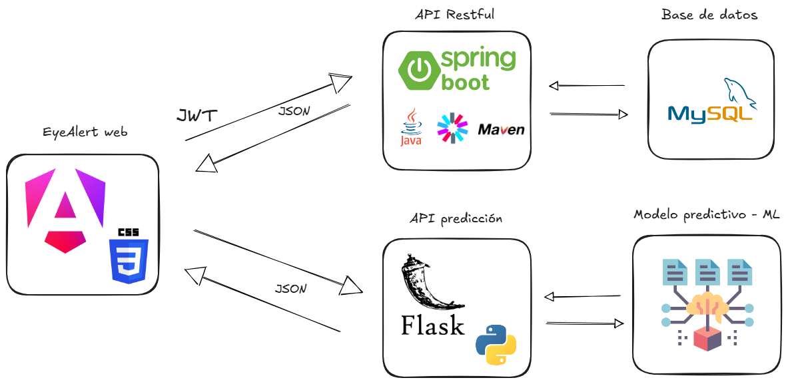

# EyeAlert API Rest

Backend de la aplicación **[EyeAlertWeb](https://github.com/MrDevv/eyeAlertWeb)**, desarrollado con **Spring Boot 3** y **MySQL**  
Este servicio se encarga de gestionar la lógica del sistema, incluyendo autenticación de usuarios, evaluaciones de glaucoma, cuestionarios, preguntas y contenido informativo.

---
## Arquitectura tecnológica general del sistema


Este repositorio forma parte de la **arquitectura tecnológica general del sistema EyeAlert** y contiene la implementación de:

- La **API RESTful** del sistema.
- La **estructura de la base de datos**.
- La **lógica de negocio** utilizada por el frontend.

---
# Tecnologías utilizadas

- Java 17
- Spring Boot 3
- Spring Security 6
- JWT Authentication
- JPA / Hibernate
- MySQL
- Maven
- Docker (opcional)

---

## ¿Cómo descargar el proyecto?
Primero descargamos el proyecto como `.zip` o lo clonamos haciendo uso del comando de `git`, de la siguiente manera:
```
git clone https://github.com/MrDevv/MolarDentalCareAPI-SpringBoot.git
```
Abrimos el proyecto en `IntelliJ IDEA`.

---
## Variables de entorno necesarias

Para ejecutar el proyecto es necesario configurar las siguientes variables de entorno en el IDE.

| Variable | Descripción |
|--------|--------|
| DB_URL | URL de conexión a la base de datos |
| DB_USER_NAME | Usuario de la base de datos |
| DB_PASSWORD | Contraseña de la base de datos |
| EMAIL | Cuenta de correo utilizada para enviar correos |
| EMAIL_PASSWORD | Contraseña de aplicación del correo |

Ejemplo:

```env
DB_URL=jdbc:mysql://localhost:3306/eyealert
DB_USER_NAME=root
DB_PASSWORD=123456
EMAIL=tu_correo@gmail.com
EMAIL_PASSWORD=clave_de_aplicacion
```

---

## Configuración del correo electrónico

Para que la API pueda enviar correos electrónicos es necesario generar una **Contraseña de aplicación en Google**.

Pasos:

1. Ir a:  
   https://myaccount.google.com/security

2. Activar **Verificación en 2 pasos**

3. Ir a:  
   https://myaccount.google.com/apppasswords

4. Crear una nueva contraseña de aplicación

5. Usar la clave generada como valor de:

```
EMAIL_PASSWORD
```

⚠️ Importante:  
No usar la contraseña normal de Gmail.

---

## Creación de la base de datos

Dentro de los recursos del proyecto se encuentra el archivo:

```
src/main/resources/data_base_sql.sql
```

Este archivo contiene todos los comandos necesarios para:

- crear la base de datos
- crear las tablas
- definir relaciones

Ejecutar este script en MySQL antes de iniciar la aplicación.

---

## Inicialización de datos

El archivo:

```
src/main/resources/data_init.sql
```

contiene datos iniciales necesarios para el funcionamiento del sistema, como:

- roles
- preguntas
- configuraciones iniciales

Ejecutar este script después de crear las tablas.

---

## Registro de usuarios

Para registrar usuarios manualmente en la base de datos es necesario guardar la contraseña **encriptada**.

El proyecto incluye un método llamado:

```
createPasswordCommand
```

ubicado en la clase:

```
EyealertBackendApplication.java
```

Este método permite:

1. ingresar una contraseña
2. generar su versión encriptada
3. copiar el valor desde la consola

Luego este valor puede ser guardado directamente en la base de datos.

---

## Ejecución del proyecto

Desde el IDE ejecutar la clase principal:

```
EyealertBackendApplication
```

La API se ejecutará en:

```
http://localhost:8080/api/v2
```


